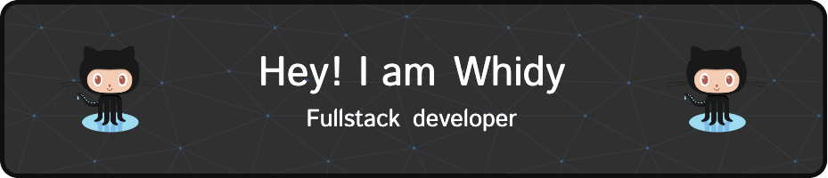

<!--  -->

  <!--  • -->
  <a href="https://www.whidy.net">Blog</a> •
  <a href="https://segmentfault.com/u/whidy">SegmentFault</a> •
  <a href="https://stackoverflow.com/users/3089701/whidy">Stackoverflow</a> •
  <a href="https://www.linkedin.com/in/whidy-bai-45334680/">LinkedIn</a>

---

:wave:&nbsp; Hi, I am whidy. Fullstack developer from Wuhan, China :cn:

:seedling:&nbsp; I’m currently learning Github Actions and UnoCSS

:hugs:&nbsp; I like write, share and play video games

:envelope:&nbsp; whidy@whidy.net

---

### :hammer_and_wrench: Languages and Tools :

  &nbsp;
  &nbsp;
  &nbsp;
  &nbsp;
  &nbsp;
  &nbsp;
  &nbsp;
  &nbsp;

---

### :book: My Lastest Blog :

<!-- BLOG-POST-LIST:START -->
- [AMD黑苹果无法使用Docker的解决办法](https://www.whidy.net/amd-hackintosh-incompatible-docker-desktop-and-solution)
- [UnoCSS动态图标icon无法显示解决方案](https://www.whidy.net/unocss-dynamic-icon-not-show)
- [Vite使用UnoCSS编译时报错：pluginContext.emitFile is not a function error during build](https://www.whidy.net/unocss-plugincontext-emitfile-error-during-build)
- [开启macOS点击窗口内任意位置快速拖动功能](https://www.whidy.net/enable-macos-click-window-anywhere-to-drag)
- [macOS必备软件Clipy配置备份](https://www.whidy.net/clipy-config-backup)
<!-- BLOG-POST-LIST:END -->

---

### :fire: My Github Stats :

<!--  -->

<!--  -->

### :watch: My Wakatime Stats :

 

If my projects help you a lot, tell me :heart:. Maybe we can sit and talk for a fun life :speech_balloon:. Drink two cups of [☕](https://ko-fi.com/whidy) will make a big deal :handshake:.
